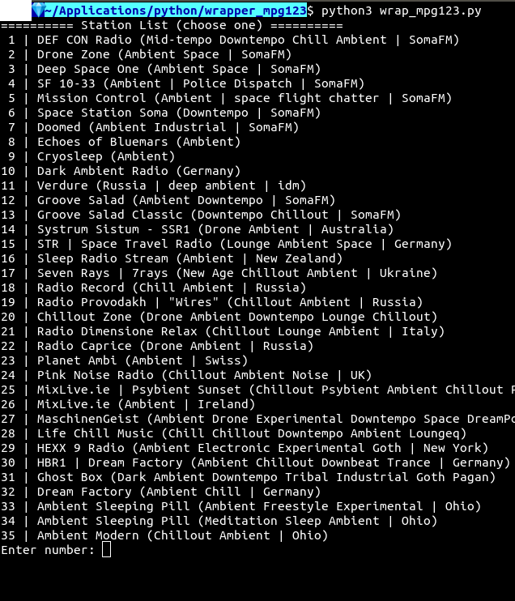

# wrap_mpg123



## shebang/interpreter directive

```bash
#!/usr/bin/env python3
```

In the first line, everything that follows the _shebang_ (`#!`) is the _interpreter directive_ (`/usr/bin/env python3`). In this case, `python3` will be called to run the file if the file is prepended with `./`. Otherwise, the script can be executed by entering `$ python3 wrap_mpg123.py` in the CLI.

---

## imports

### csv.reader()

```python
from csv import reader
```

The `csv.reader()` method generates a reader object which iterates through CSV records using the `next()` method, line by line.

---

### subprocess.run()

```python
from subprocess import run
```

The `subprocess.run()` method passes arguments from the script to the Bash CLI.

---

## function

### Definition

```python
def wrap():
```

The `wrap()` function's definition.

---

### Dictionary

```python
url_dict = {}
```

The `url_dict` dictionary stores enumerated URLs.

---

### First Line

```python
print(f'========== Station List (choose one) ==========')
```

The first line of the Internet radio station list prints.

---

### With Statement, Open Method

```python
with open('stations_urls.csv', mode='r') as file_obj:
```

A [with](https://docs.python.org/2.5/whatsnew/pep-343.html) statement includes better syntax and exceptions handling. It will also close the file, and ensure execution of clean-up.

The [open()](https://docs.python.org/3/library/functions.html#open) method opens the CSV database and returns a [file object](https://docs.python.org/2.0/lib/bltin-file-objects.html), e.g. `<_io.TextIOWrapper name='stations_urls.csv' mode='r' encoding='UTF-8'>`. The file object header example indicates the `name` of the file. The text I/O's `mode` of `r` indicates that the file object will be exposed to the file-oriented API's `read()` method. Lastly, the `encoding` is then `UTF-8`.

---

### CSV Reader Method

```python
reader_obj = reader(file_obj)
```

```bash
<_csv.reader object at 0x7fecf65b8278>
```

The `reader(file_obj)` method returns a reader object which iterates over the CSV records, line by line. Since `file_obj` supports the `reader_obj`'s iterator protocol, a string will be returned with each call to its `next()`, until the file is exhausted.

---

### For Loop

```python
for i, row in enumerate(reader_obj, start=1):
```

The `for` loop definition's `enumerate()` method iterates through the `reader_obj`, starting enumeration at `1`, instead of zero, because the numbers are associated with Internet radio stations. Each `row` is a CSV database record.

---

```python
print(f'{i:2} | {row[0]}')
```

Incremental values are printed, followed by their associated radio station descriptions.

---

### Dictionary

```python
url_dict[i] = row[1]
```

At the same time the station list is printed to the terminal emulator, a number key and a URL value is appended to the `url_dict`.

```bash
{1: 'http://ice2.somafm.com/defcon-128-aac', 2: 'http://ice1.somafm.com/dronezone-256-mp3', 3: 'https://somafm.com/deepspaceone130.pls', 4: 'http://somafm.com/sf1033130.pls', 5: 'https://somafm.com/missioncontrol130.pls', 6: 'http://ice3.somafm.com/spacestation-128-mp3', 7: 'http://somafm.com/specials130.pls', 8: 'http://streams.echoesofbluemars.org:8000/bluemars', 9: 'http://streams.echoesofbluemars.org:8000/cryosleep', 10: 'http://s3.viastreaming.net:8835/', 11: 'http://air.verdure.net:8881/stream', 12: 'http://ice1.somafm.com/groovesalad-256-mp3', 13: 'https://somafm.com/gsclassic130.pls', 14: 'http://systrum.net:8000/Systrum-Channel1.m3u', 15: 'http://136.243.156.30:1701/stream/2/', 16: 'http://149.56.234.138:8169/stream', 17: 'http://7rays.stream.laut.fm/7rays', 18: 'http://air.radiorecord.ru:8102/chil_320', 19: 'http://station.waveradio.org/provodach', 20: 'http://5.189.142.165:2304/stream', 21: 'http://tachyon.shoutca.st:8919/stream', 22: 'http://79.111.119.111:8002/droneambient', 23: 'http://philae.shoutca.st:9019/stream', 24: 'http://uk1.internet-radio.com:8004/stream', 25: 'http://198.24.145.146:9318/stream', 26: 'http://mixlive.ie:9332/;ambient', 27: 'http://i.20hz.biz:8000/maschinengeist.org.192.mp3', 28: 'http://aska.ru-hoster.com:8053/autodj', 29: 'http://46.105.124.120:8604/stream', 30: 'http://radio.hbr1.com:19800/ambient.ogg', 31: 'http://108.61.154.147:5940', 32: 'http://ubuntu.hbr1.com:19800/ambient.ogg', 33: 'http://radio.stereoscenic.com/asp-s', 34: 'http://radio.stereoscenic.com/asp-h', 35: 'http://radio.stereoscenic.com/mod-h'}
```

---

### Choose Number

```python
station_number = int(input('Enter number: '))
```

The radio listener is prompted to choose a number corresponding to a radio station description.

---

### Play Internet Radio Station

```python
run(['mpg123', url_dict[station_number]])
```

The `subprocess.run()` method passes arguments to the Bash CLI. For example, it calls `mpg123 'http://ice2.somafm.com/defcon-128-aac'`, and passes a URL argument in the CLI.

---

```python
if __name__ == '__main__':
    wrap()
```

When a module is used as a standalone, it's `__name__` value will be `__main__`. But if this module was imported into another module, its name would no longer be `__main__`, so it would be available, but would not start automatically.

[](https://ko-fi.com/R6R72LISM)
